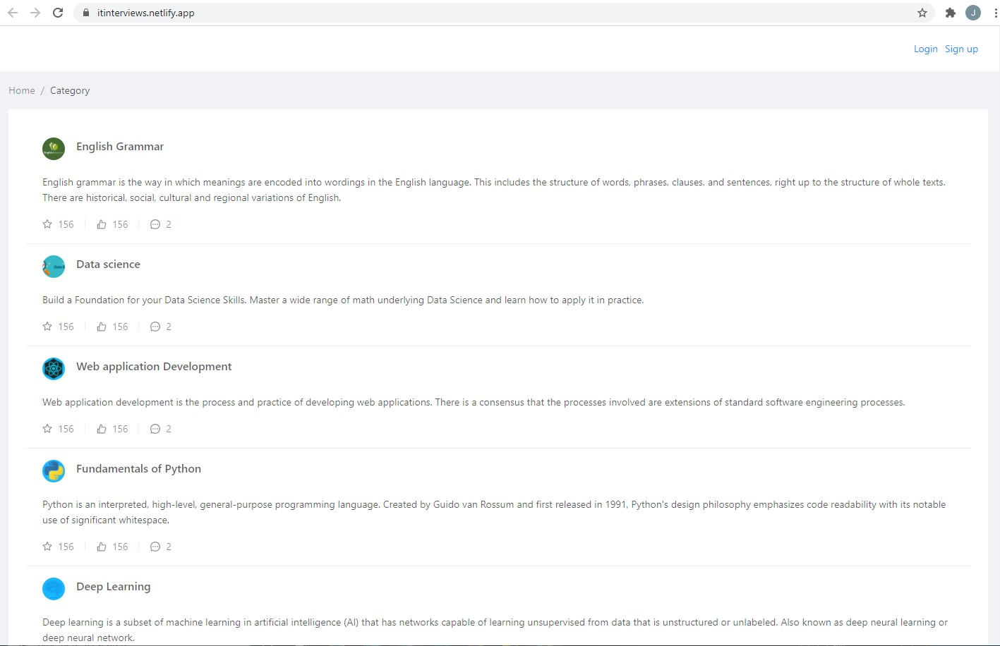
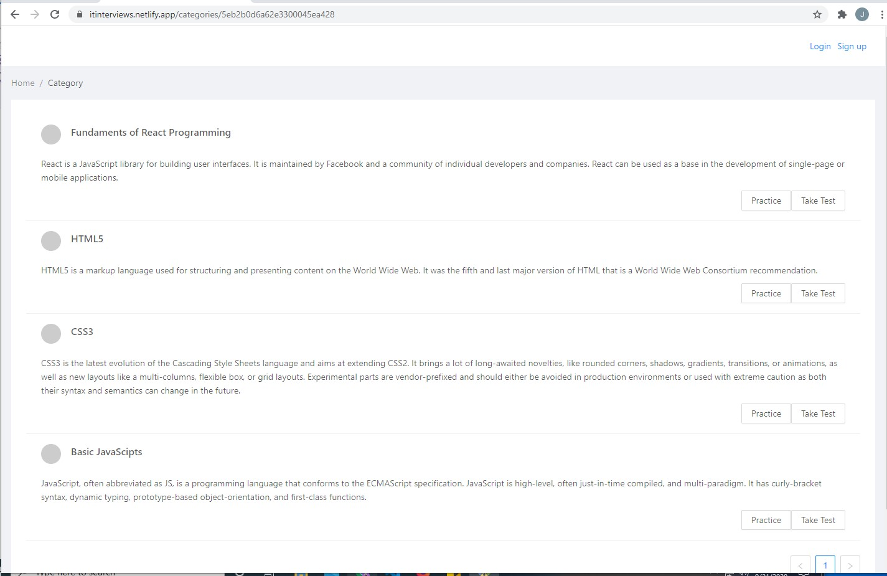
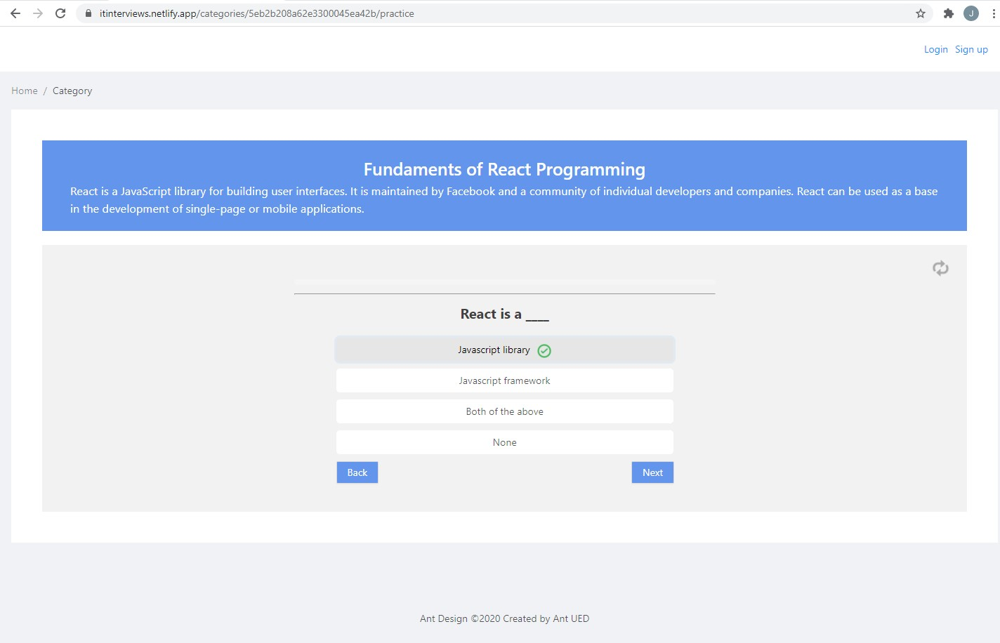
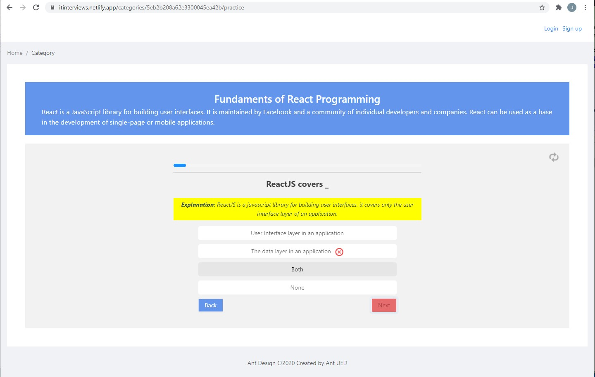
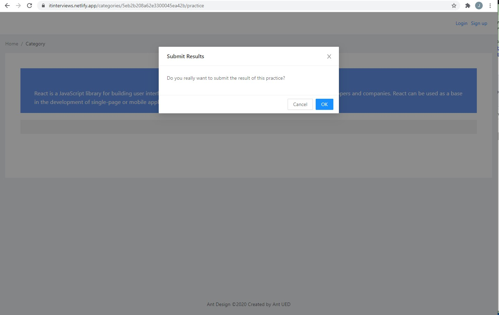
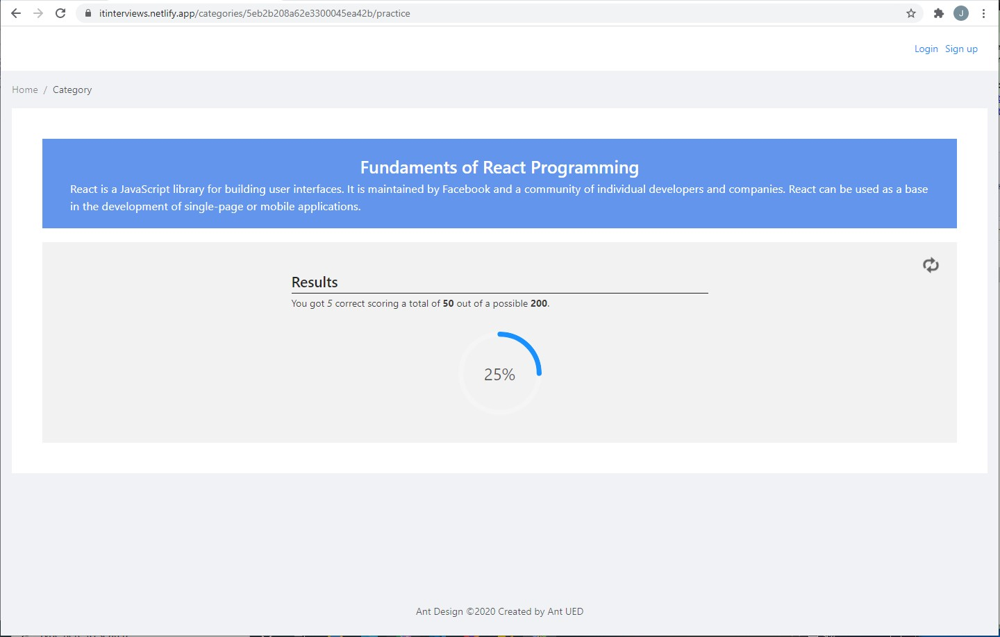

# React Quiz with GraphQL

It's a react-quiz web app for multiple or single questions based on web development knowledge and skill.

# Start

yarn install

yarn start

# Project URL

https://itinterviews.netlify.com/

### HomePage

### Categories

### Test & Practice - 1

### Test & Practice - 2

### Submit Results

### Results

## Contributors

